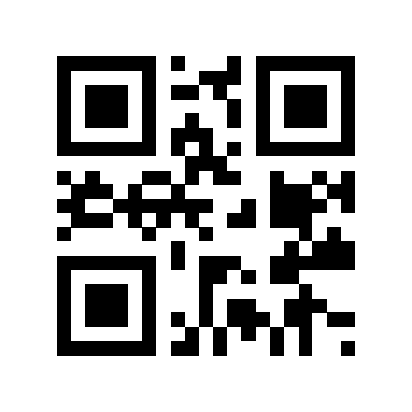
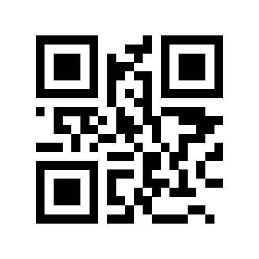

# INTRODUCTION
This is a repo containing all my code written for the web based augmented reality side
of the Space Shapers project. Each of the four folders contains the .html and .js files
for the respective projects including both a English and Spanish version of the 
i spy and dance projects.

# WHAT IS SPACE SHAPERS?
Space Shapers is a project that aims to teach children about the importance of
spacial awareness and how to use it to their advantage. The code in this repo is
for the augmented reality card deck included in the Space Shapers prototype. The
prototype was created for Austin PBS as a project under UT Austin's Texas Immersive
Institute. 

# HOW IT WORKS
These web applications are hosted on 8th wall and can be accessed by scanning the QR
codes listed below. Once the QR code is scanned the user will be prompted to allow
access to their camera and then the application will begin. The both the iSpy and dance
applications search for one of the 4 target images provided in the card deck.

# QR CODES
## Space Shapers Dance English QR Code

## Space Shapers Dance Spanish QR Code

## Space Shapers iSpy English QR Code

## Space Shapers iSpy Spanish QR Code
